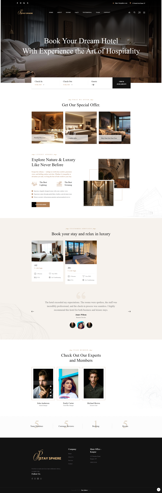
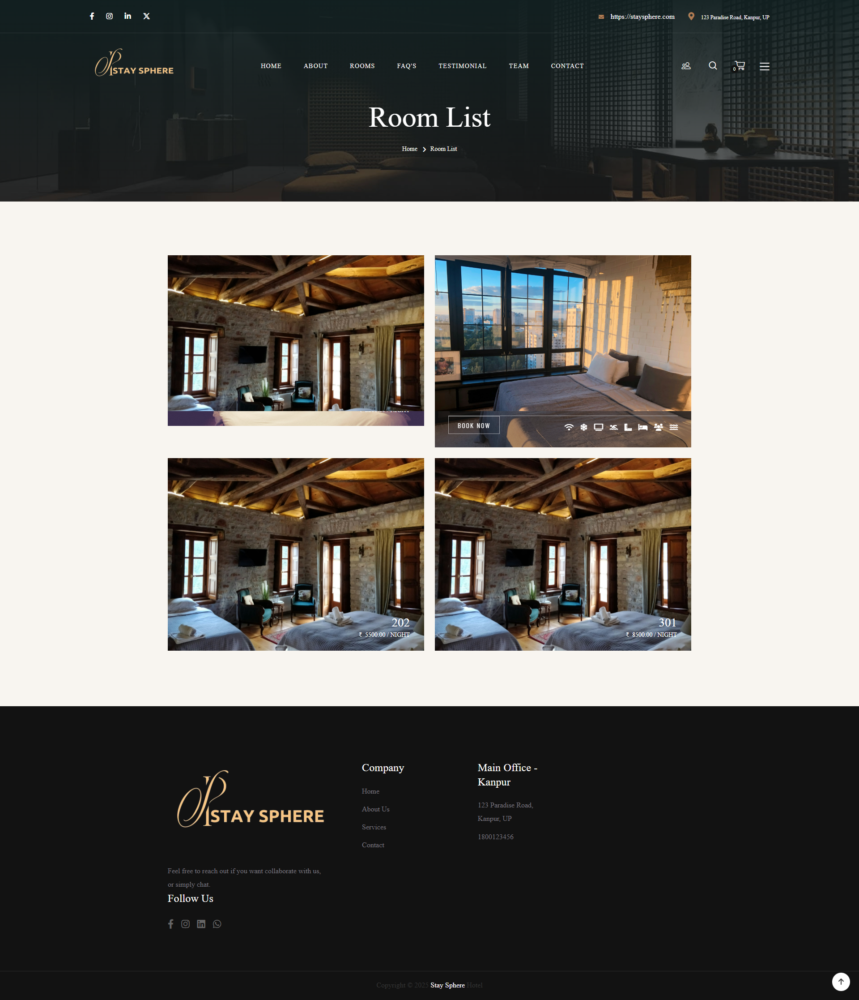
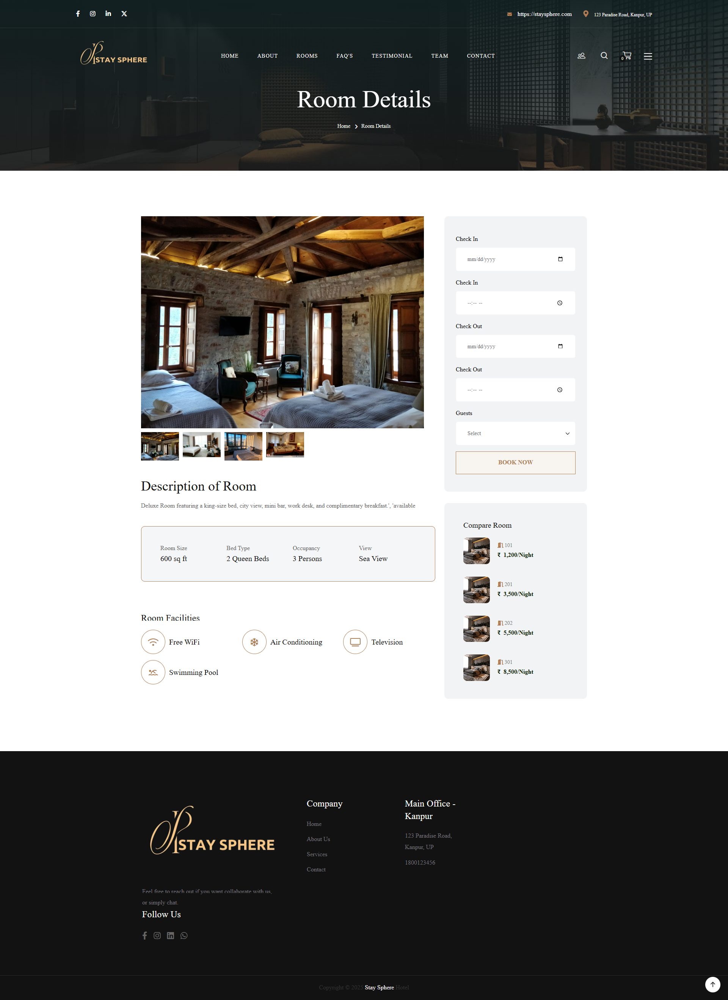

<div align="center">

# 🏨 StaySphere
### Modern Hotel Booking Management System

A modern, responsive and feature-rich Hotel Booking Management System built with **Laravel 12**, designed to provide a seamless experience for hotel owners and customers.

[](https://laravel.com/)
[](https://php.net/)
[](https://getbootstrap.com/)
[](https://mysql.com/)
[](#license)

### 🌐 Live Demo

**🔗 https://YOUR_DEMO_LINK**

---

</div>

# 📖 About

StaySphere is a complete hotel booking platform developed using **Laravel 12**. It enables customers to browse rooms, check availability, book rooms online, and manage reservations, while administrators can efficiently manage hotels, rooms, bookings, users, facilities, reviews, and website content through a powerful admin dashboard.

The project follows Laravel's MVC architecture and focuses on clean code, scalability, security, and responsive UI.

---

# ✨ Features

## 👤 Customer Features

- User Registration & Login
- Browse Available Rooms
- Room Details Page
- Check Room Availability
- Online Room Booking
- Booking History
- Wishlist
- Reviews & Ratings
- Responsive Design
- Profile Management
- Contact Form
- FAQ Section

---

## 🛠 Admin Features

- Secure Admin Dashboard
- Hotel Room Management
- Booking Management
- User Management
- Team Management
- Facilities Management
- FAQ Management
- Website Settings
- Role & Permission Management
- Customer Reviews
- Image Upload
- Dashboard Analytics

---

# 🚀 Tech Stack

| Category | Technology |
|-----------|------------|
| Backend | Laravel 12 |
| Language | PHP 8.2+ |
| Database | MySQL |
| Frontend | HTML5, CSS3, Bootstrap 5 |
| JavaScript | JavaScript, jQuery |
| Icons | Font Awesome |
| Authentication | Laravel Authentication |
| Storage | Laravel Storage |
| Version Control | Git & GitHub |

---

# 📸 Project Preview

## 🏠 Home Page



---

## 🛏 Room Listing



---

## 🏨 Room Details



---

# 📂 Project Structure

```
StaySphere
│
├── app/
├── bootstrap/
├── config/
├── database/
├── public/
├── resources/
├── routes/
├── storage/
├── tests/
├── vendor/
├── composer.json
└── package.json
```

---

# ⚙ Installation

### Clone Repository

```bash
git clone https://github.com/Anujknp1206/StaySphere.git
```

Move into project

```bash
cd StaySphere
```

Install Dependencies

```bash
composer install
```

Install Node Packages

```bash
npm install
```

Create Environment File

```bash
cp .env.example .env
```

Generate Application Key

```bash
php artisan key:generate
```

Configure your database in

```
.env
```

Run Migration

```bash
php artisan migrate
```

Create Storage Link

```bash
php artisan storage:link
```

Run Vite

```bash
npm run dev
```

Start Server

```bash
php artisan serve
```

Open

```
http://127.0.0.1:8000
```

---

# 📁 Environment

```
PHP >= 8.2
Laravel 12
Composer
Node.js
NPM
MySQL
Apache / Nginx
```

---

# 🎯 Future Improvements

- Stripe Payment Gateway
- Razorpay Integration
- Email Notifications
- Coupon & Discount System
- Hotel Owner Panel
- Multi-language Support
- Booking Invoice PDF
- Real-time Room Availability
- Google Maps Integration
- AI Room Recommendation

---

# 👨‍💻 Developer

## Anuj Yadav

**Backend Developer | Laravel Developer**

- 💼 LinkedIn: https://www.linkedin.com/in/anujyadav1206/
- 🐙 GitHub: https://github.com/Anujknp1206
- 📧 Email: anujknp1206@gmail.com
---

# ⭐ Support

If you found this project helpful, please consider giving it a **⭐ Star** on GitHub.

It helps others discover the project and motivates future improvements.

---

# 📜 License

This project is licensed under the **MIT License**.